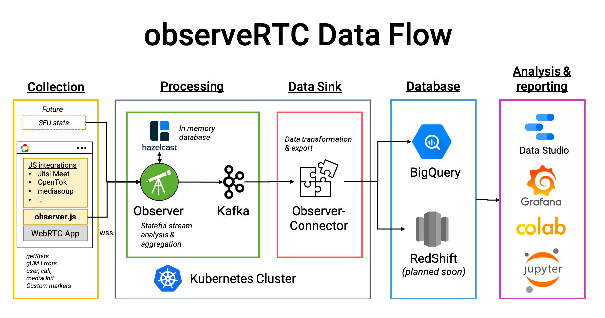

CHAD'S COMMENTS
================

! Don't merge this to the main branch - for observerRTC team discussion

* CHANGELOG.MD - does that need to be updated?
* What tool did you use to make your images?
* I moved some items to a new quickstart page at /docs/get-started
* That quick start could use a a pre-requisites section and video or image showing the output
* "Observer" vs. "ObserveRTC" - these terms seems to be mixed up (or I lost track of what they are). ObserveRTC - refers to the entire project? Observer is a specific elment of the project (the one that collects data)
* Is this video still relevant? https://www.youtube.com/watch?v=RZ58vapWfUw&t=23s
* Do we need a separate site at https://observertc.github.io/ ?
* What changes need to be made to this graphic? 
